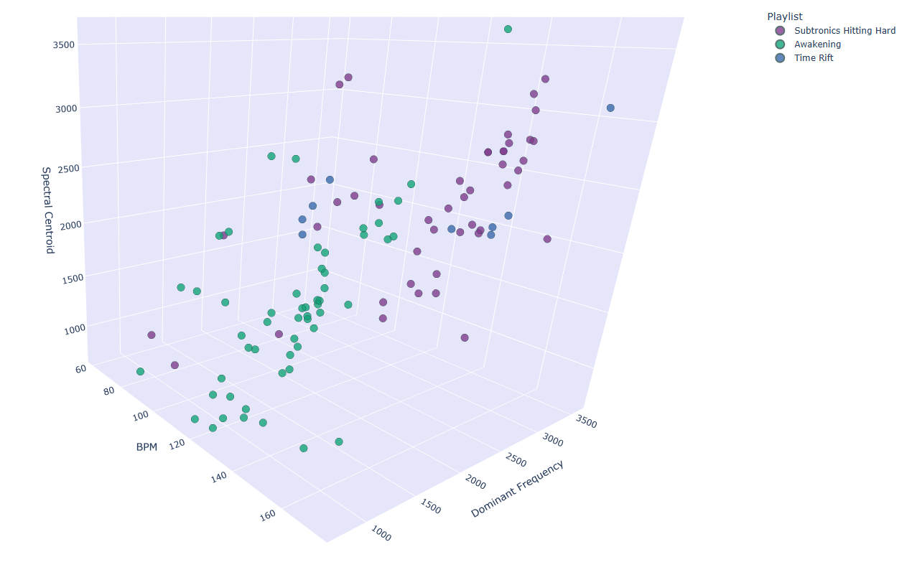

# MusicNet: Music Analysis and Visualization Platform

MusicNet is a Python-based platform for downloading, analyzing, and visualizing music from Spotify playlists. It extracts audio features using the librosa library and creates interactive visualizations to explore relationships between songs based on their audio characteristics.



## Features

### Music Library Management

- **Spotify Integration**: Import playlists directly from Spotify
- **Intelligent Downloading**: Automatically downloads songs from YouTube based on Spotify metadata
- **SQLite Database**: Efficient storage and retrieval of music library data
- **Duplicate Detection**: Identifies and manages duplicate songs in the library
- **Library Statistics**: Generates comprehensive statistics about your music collection

### Audio Feature Extraction

- **Parallel Processing**: Extract features from multiple songs simultaneously using multiprocessing
- **Comprehensive Audio Analysis**: Extracts over 30 audio features including:
  - Tempo/BPM detection
  - Spectral characteristics (centroid, bandwidth, rolloff, flatness)
  - Pulse clarity and rhythmic features
  - MFCC coefficients for timbre analysis
  - Chroma features for harmonic content and key detection
  - Zero crossing rate for percussiveness
  - RMS energy for loudness
  - Harmonic-percussive separation ratio

### Data Visualization

- **3D Interactive Plots**: Visualize audio features in three-dimensional space
- **Playlist Comparison**: Compare audio characteristics across different playlists
- **Export Capabilities**: Save visualizations as interactive HTML files

## Interactive Visualizations

The project generates interactive 3D visualizations that can be explored in your browser:

- [View 3D Feature Visualization](https://htmlpreview.github.io/?https://github.com/PetrouilFan/musicnet/blob/main/visualizations/music_features_3d.html) - Explore the audio features in 3D space
- [View Feature Matrix](https://htmlpreview.github.io/?https://github.com/PetrouilFan/musicnet/blob/main/visualizations/feature_matrix.html) - See the relationships between different audio features

## Requirements

- Python 3.7+
- Libraries:
  - librosa (audio analysis)
  - numpy (numerical processing)
  - spotipy (Spotify API client)
  - yt_dlp (YouTube downloading)
  - plotly (data visualization)
  - sqlite3 (database, included in Python standard library)

## Installation

1. Clone the repository:
   ```bash
   git clone https://github.com/PetrouilFan/musicnet.git
   cd musicnet
   ```

2. Install dependencies:
   ```bash
   pip install -r requirements.txt
   ```

3. Configure Spotify API credentials in `settings.py`:
   ```python
   SPOTIFY_CLIENT_ID = "your_client_id"
   SPOTIFY_CLIENT_SECRET = "your_client_secret"
   ```

## Setup

### Configuration

This project requires a `settings.py` file with your Spotify API credentials to work properly. Follow these steps to set it up:

1. Copy the provided `settings_example.py` file to `settings.py`:
   ```
   cp settings_example.py settings.py
   ```

2. Edit `settings.py` and add your Spotify API credentials:
   - `SPOTIFY_CLIENT_ID`: Your Spotify application client ID
   - `SPOTIFY_CLIENT_SECRET`: Your Spotify application client secret
   - `SPOTIFY_PLAYLIST_URLs`: List of Spotify playlist URLs you want to work with

### Getting Spotify API Credentials

1. Visit the [Spotify Developer Dashboard](https://developer.spotify.com/dashboard/)
2. Log in with your Spotify account
3. Create a new application
4. Copy the Client ID and Client Secret to your `settings.py` file

## Why settings.py is not in the repository

The `settings.py` file contains personal API keys and is excluded from the repository (via .gitignore) for security reasons. Never commit your API keys to a public repository.

## Usage

### Running the Application

Simply run the main script:
```bash
python plotter.py
```

This will:
- Load playlists from Spotify
- Download songs from YouTube
- Extract audio features (using cached features when available)
- Generate a 3D visualization of the audio features

### Configuration Options

All configuration is done at the top of the `plotter.py` file through constants:

```python
# Feature extraction settings
USE_PARALLEL_PROCESSING = True
NUM_PROCESSES = 4  # Number of parallel processes for feature extraction
FORCE_EXTRACTION = False  # Whether to force re-extraction of features

# Processing flags
SKIP_DOWNLOAD = False  # Set to True to skip downloading MP3 files
SKIP_EXTRACTION = False  # Set to True to skip feature extraction
SKIP_PLOTS = False  # Set to True to skip generating plots
GENERATE_MATRIX_PLOT = False  # Set to True to generate additional feature matrix plot
GENERATE_STATISTICS = True  # Set to True to generate library statistics

# Feature selection for visualization
FEATURE_INDICES = [0, 1, 2]  # BPM, Dominant Frequency, Spectral Centroid
```

### Feature Caching

Features are cached in the database and only calculated for new songs by default. To force recalculation of all features, set:

```python
FORCE_EXTRACTION = True
```

### Library Management

```python
from musicnet_library import Library, Playlist

# Initialize library
library = Library()

# Load existing library
library.load()

# Add a playlist
new_playlist = Playlist("My Playlist", "https://open.spotify.com/playlist/your_playlist_id")
library.add_playlist(new_playlist)

# Download songs
library.download_all()

# Extract features (using parallel processing)
library.extract_all(parallel=True, max_processes=4)

# Find duplicate songs
duplicates = library.find_duplicates()

# Clean up duplicates
library.cleanup_duplicates()

# Get library statistics
stats = library.generate_library_stats()
print(stats)

# Save library
library.save()

# Close database connection
library.close()
```

## How MusicNet Works

MusicNet operates in several stages:

1. **Library Initialization**: Creates a database for storing music metadata and features
2. **Playlist Import**: Retrieves playlist information from Spotify
3. **Song Download**: Uses YouTube to find and download audio files for each track
4. **Feature Extraction**: Analyzes the audio to extract musical characteristics
5. **Visualization**: Creates interactive plots to visualize the music in feature space

### Multiprocessing Feature Extraction

MusicNet uses Python's multiprocessing capabilities to parallelize the feature extraction process:

1. Songs are divided into chunks
2. Each chunk is processed by a separate worker process
3. Results are collected and merged back into the main library
4. Progress is tracked and reported in real-time

## Project Structure

- `musicnet_library.py`: Core library management functionality
- `feature_extract.py`: Audio analysis and feature extraction
- `plotter.py`: Visualization and plotting functions
- `settings.py`: Configuration settings
- `library/`: Directory containing database, MP3 files, and cached data
- `visualizations/`: Interactive HTML visualizations (tracked in git)

## Future Development Plans

- Genre classification using machine learning
- Recommendation system based on audio similarity
- Custom playlist generation based on audio features
- Web interface for library management and visualization
- Expanded metadata enrichment from additional sources

## Contributing

Contributions are welcome! Please feel free to submit a Pull Request.

## License

This project is licensed under the MIT License
